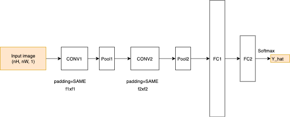

# fashion_mnist_recognizer
First lab of Computer Vision in Applications course. Designing a deep network (CNN) to classify Fashion-Mnist dataset

## Install packages
```pip install -r requirements.txt```

## Quá trình chuẩn bị dữ liệu:
- Đối với dữ liệu có tổng cộng 60000 ảnh (28x28) trong training set và 10000 ảnh (28x28) trong test set. 
Shuffle training data để chia tập train thành tập train 50000 ảnh và tập val 10000 ảnh.
- Normalize data về range (0, 1) bằng cách chia 250.
- Visualize dữ liệu
- Augment dữ liệu (phần này hiện thời chưa fit vào model do thời gian không kịp): sử dụng 2 phép crop và horizontal flip để augment dữ liệu.

## Các bước để train CNN model bằng tensorflow:
- Init computation graph. 
- Create placeholders for training set X and Y.
- Init parameters W1 and W2 for model.
- Forward propagation.
- Compute cost
- Create optimizer to minimize cost and tensorflow will perfome back prop for us
- Init global variables for model
- Start session and execute above operators per epoch

## Quá trình cải tiến
Em sẽ dựa vào độ chính xác trên tập val cho mỗi model để chọn ra model với độ chính xác cao nhất làm model cuối cùng.



- CONV: filter size (3x3 hoặc 5x5), padding 'SAME' và activation function Relu
- Pool layer: stride = 2
- FC1: vector 1024 chiều
- FC2: vector 10 chiều

### Kiến trúc mạng 1:
Mỗi CONV block bao gồm: Conv -> Relu và Dropout được dùng như regularization trước FC2.
### Kiến trúc mạng 2:
Mỗi CONV block bao gồm: Conv -> Relu -> BatchNorm và sau mỗi Pool layer và FC1 thì đều có dropout để regularization.

Với những lần thực nghiệm ở từng kiến trúc mạng, em đã điều chỉnh các tham số như:
- kernel size: f1, f2 (3 hoặc 5)
- learning_rate: 1e-2, 1e-3, 1e-4.
- weight_decay: sử dụng để regularize nhấm trành overfitting (mặc định: 5e-4)
- num_epoches: số lần học (Ví dụ: 50, 80, 100)
- batch_size: 32 hoặc 64
- keep_prob: dùng cho dropout (0.5, 0.6) có tác dụng giảm bớt sự lệ thuộc của network vào một số node nhất định và cũng dùng để regularization nhằm tránh overfitting.

## Fit model:
```python
_, _, params = fit_model(X_train, Y_train, X_val, Y_val, \
                         no_epochs=3, learning_rate = 1e-4, keep_prob_input=0.5, weight_decay=5e-4, \
                         minibatch_size=50, plot_learning_curve=True, model_name=dtime, model_number=1)
```
Với, model_number (0 hoặc 1): Chỉ thị kiến trúc mạng cần dùng

## Evaluate:
```python
evaluate(model_meta_file=path+'/'+dtime+'-1000.meta', X_test, Y_test)
```
Tham số:
- model_meta_file: của pretrained model
- X_test: data test
- Y_test: lables của tập test
  
## Chạy commandline
```
python 1612174.py -train "Training set files (.csv)" -test "Test set files (.csv)"
```

**Đồng thời, em có soạn một file .ipynp để minh hoạ trực quan quá trình làm.**
